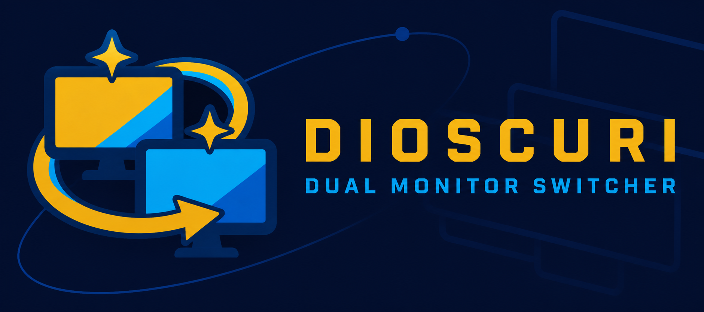
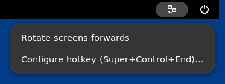
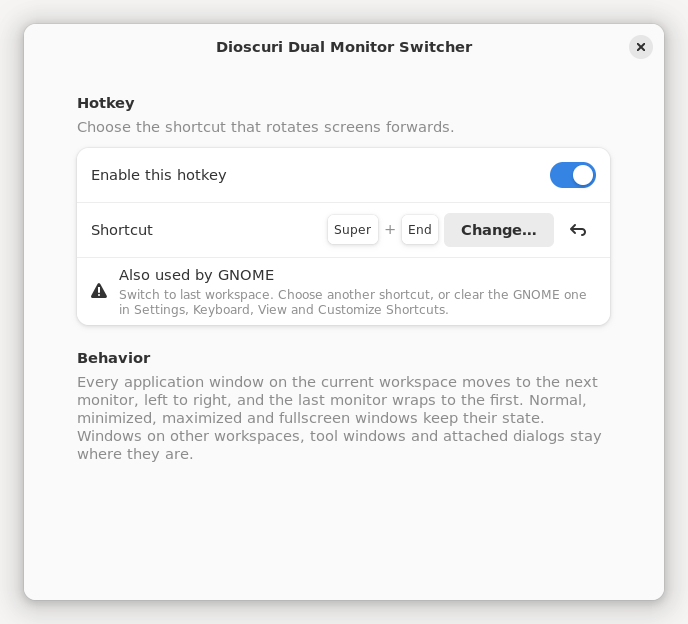

<p align="center">
  
</p>

# Dioscuri Dual Monitor Switcher for GNOME

GNOME Shell port of [Dioscuri](https://github.com/Jamir-boop/dioscuri-dual-monitor-switcher).
One hotkey moves every application window to the next monitor.



## Requirements

- GNOME Shell 46, 47 or 48, on X11 or Wayland
- Two or more monitors

## Install

```sh
git clone https://github.com/Jamir-boop/dioscuri-gnome-extension.git
cd dioscuri-gnome-extension
./install.sh
```

Restart GNOME Shell. On X11 press `Alt+F2`, type `r`, press `Enter`. On Wayland log out and back in. Then enable it:

```sh
gnome-extensions enable dioscuri@jamir-boop.github.io
```

`install.sh` needs `glib-compile-schemas`. On Debian and Ubuntu it comes with `libglib2.0-bin`. Run `./install.sh` again to update. Run `./install.sh uninstall` to remove.

## Use

Press `Ctrl+Super+End` to rotate windows forwards, or use the monitor icon in the top bar.

- Monitors are ordered left to right, then top to bottom. The last monitor wraps to the first.
- Normal, minimized, maximized and fullscreen windows move and keep their state.
- Windows on other workspaces stay put. So do docks, desktop icons, menus, tool palettes and dialogs attached to a parent window.
- With one monitor, nothing moves and a notification says so.

## Hotkey

Open the preferences from the top bar menu or from Extension Manager. Press **Change…** and type the new shortcut. `Backspace` there disables the hotkey. The undo button resets it. A warning appears when the shortcut is already a built-in GNOME shortcut.



The Windows build uses `Win+End`. GNOME already binds `Super+End` to *Switch to last workspace*, so the default here is `Ctrl+Super+End`. To use `Super+End` anyway, clear the GNOME shortcut first:

```sh
gsettings set org.gnome.desktop.wm.keybindings switch-to-workspace-last "[]"
```

Then pick `Super+End` in the preferences. To undo:

```sh
gsettings reset org.gnome.desktop.wm.keybindings switch-to-workspace-last
```

## Differences from the Windows build

| Windows build | GNOME extension |
|---|---|
| `Win+End` | `Ctrl+Super+End`, because GNOME owns `Super+End` |
| Tray icon | Top bar icon with the same menu |
| Start with Windows | Enabled extensions load at login |
| Exit | Disable the extension |
| Settings in `dioscuri.json` | GSettings under `/org/gnome/shell/extensions/dioscuri/` |
| May not move windows of elevated apps | Moves every eligible window |
| `--self-test` | Unit and end-to-end tests below |

## Tests

Unit tests need Node.js 20 or later:

```sh
npm test
```

The end-to-end test starts a private headless GNOME Shell with virtual monitors. It opens real windows, presses the hotkey through a virtual keyboard, and checks where every window lands. It does not touch your session or your settings.

```sh
tests/e2e/run.sh 2    # 1, 2 or 3 monitors
```

CI runs both on Ubuntu 24.04, which ships GNOME Shell 46.

## License

MIT. See `LICENSE`.
